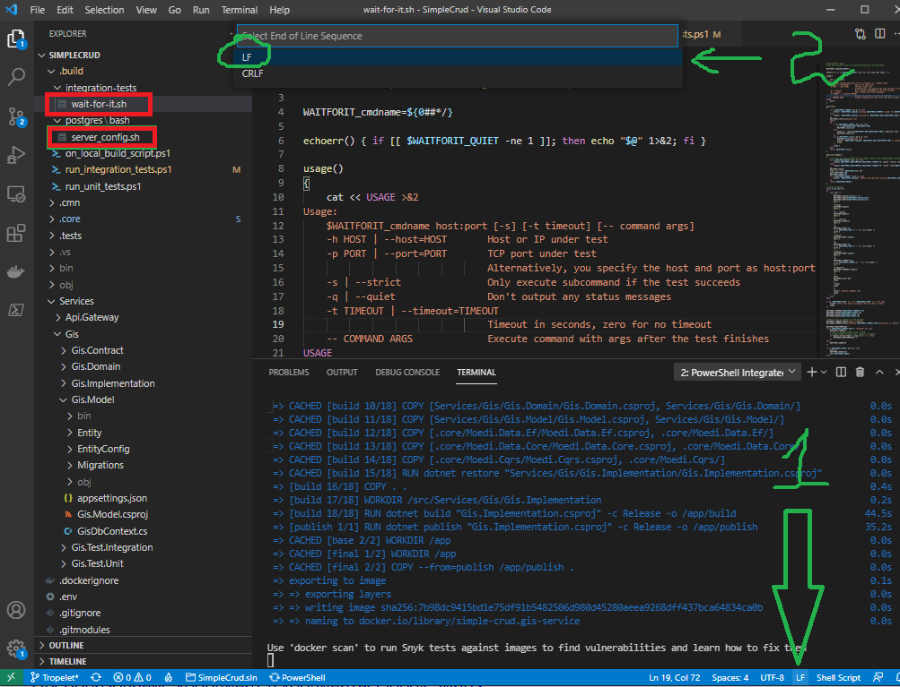
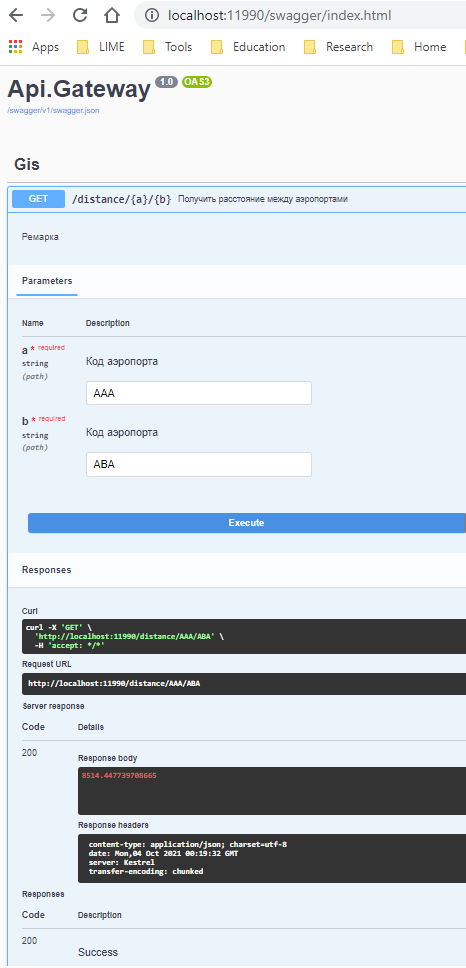

# SimpleCrud

Ваша ветка Tropelet

### 1. Затягиваем сабрепозиторий:
```git submodule update --init --recursive```

### 2. Билдим проект командой 
```dotnet build .\docker-compose.dcproj /p:SolutionDir=$(Get-Location)\```

Или используем Visual Studio 2019, открываем решение и выставляем запускаемый по умолчанию проект:
Solution Explorer -> docker-compose(.dcproj) -> right click -> Set as StarUp project
Делаем ребилд. 

!!*Отработают задачи, которые поднимают локальную инфраструктуру для ведения разработки.*

### 3. Стартуем интеграционные тесты: 
Будут качаться образы, так что это может занять до 15 минут.

```.\.build\run_integration_tests.ps1```

!!*Скорей всего ошибка возникнет при первом запуске интеграцонных тестов:*

>/usr/bin/env: 'bash\r': No such file or directory

*Это гит у винды меняет знаки окончания строки в .sh файлах, а они потом не выполняются внутри контейнера из-за этого. Фиксим так:*


Используйте сваггер: http://localhost:11990/swagger/

### 4. Запускаем юнит тесты
```.\.build\run_unit_tests.ps1```

Или используем Visual Studio 2019

### 5. Запускаем проект
```docker-compose up```

Или используем Visual Studio 2019.

Swagger доступе по ссылке:
>http://localhost:11990/swagger/index.html

